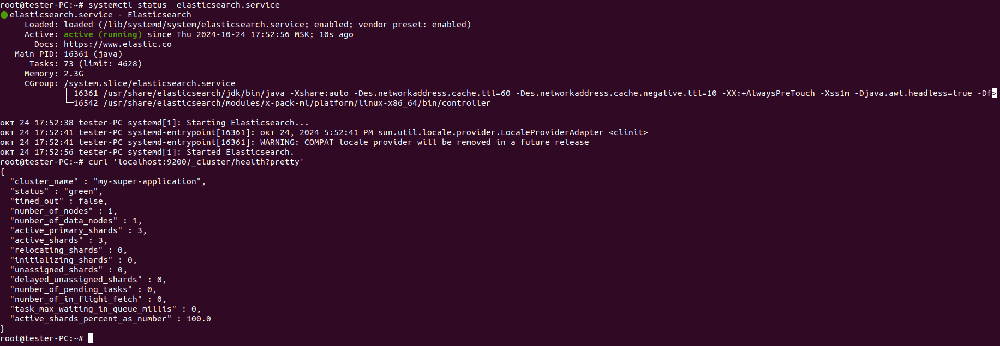
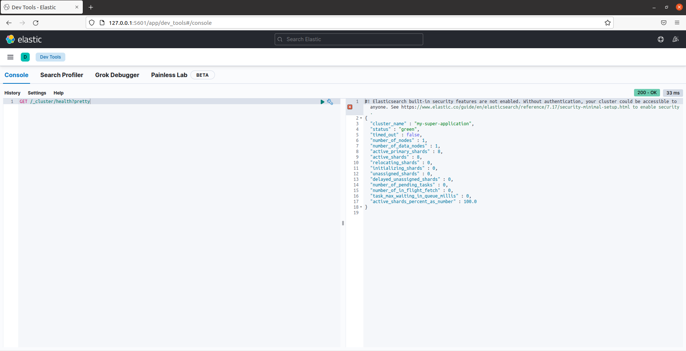
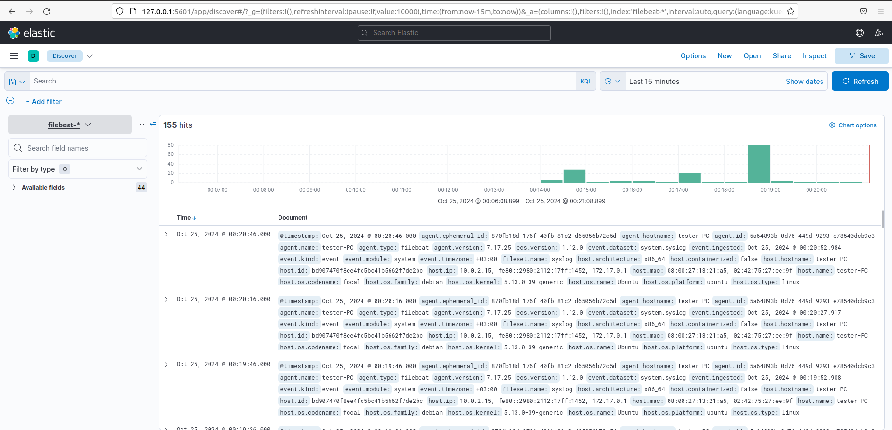

# Домашнее задание к занятию «`ELK`» - `Коряко Виталий`

https://github.com/netology-code/sdb-homeworks/blob/main/11-03.md

---

## Дополнительные ресурсы

При выполнении задания используйте дополнительные ресурсы:
- [docker-compose elasticsearch + kibana](11-03/docker-compose.yaml);
- [поднимаем elk в docker](https://www.elastic.co/guide/en/elasticsearch/reference/7.17/docker.html);
- [поднимаем elk в docker с filebeat и docker-логами](https://www.sarulabs.com/post/5/2019-08-12/sending-docker-logs-to-elasticsearch-and-kibana-with-filebeat.html);
- [конфигурируем logstash](https://www.elastic.co/guide/en/logstash/7.17/configuration.html);
- [плагины filter для logstash](https://www.elastic.co/guide/en/logstash/current/filter-plugins.html);
- [конфигурируем filebeat](https://www.elastic.co/guide/en/beats/libbeat/5.3/config-file-format.html);
- [привязываем индексы из elastic в kibana](https://www.elastic.co/guide/en/kibana/7.17/index-patterns.html);
- [как просматривать логи в kibana](https://www.elastic.co/guide/en/kibana/current/discover.html);
- [решение ошибки increase vm.max_map_count elasticsearch](https://stackoverflow.com/questions/42889241/how-to-increase-vm-max-map-count).

**Примечание**: если у вас недоступны официальные образы, можете найти альтернативные варианты в DockerHub, например, [такой](https://hub.docker.com/layers/bitnami/elasticsearch/7.17.13/images/sha256-8084adf6fa1cf24368337d7f62292081db721f4f05dcb01561a7c7e66806cc41?context=explore).

---

### Задание 1. Elasticsearch 

Установите и запустите Elasticsearch, после чего поменяйте параметр cluster_name на случайный. 

*Приведите скриншот команды 'curl -X GET 'localhost:9200/_cluster/health?pretty', сделанной на сервере с установленным Elasticsearch. Где будет виден нестандартный cluster_name*.

### Решение 1

```
apt update && apt install gnupg apt-transport-https

# wget -qO - https://artifacts.elastic.co/GPG-KEY-elasticsearch | sudo apt-key add -
cat GPG-KEY-elasticsearch | apt-key add -
echo "deb [trusted=yes] https://mirror.yandex.ru/mirrors/elastic/7/ stable main" | sudo tee /etc/apt/sources.list.d/elastic-7.x.list

apt update && apt-get install elasticsearch

systemctl daemon-reload
systemctl enable elasticsearch.service
systemctl start elasticsearch.service

nano /etc/elasticsearch/elasticsearch.yml
# change cluster.name
systemctl restart elasticsearch.service

curl 'localhost:9200/_cluster/health?pretty'

```

[GPG-KEY-elasticsearch](./GPG-KEY-elasticsearch)



---

### Задание 2. Kibana

Установите и запустите Kibana.

*Приведите скриншот интерфейса Kibana на странице http://<ip вашего сервера>:5601/app/dev_tools#/console, где будет выполнен запрос GET /_cluster/health?pretty*.

### Решение 2

```
# add yandex repo like with elastic and then install

apt install kibana
systemctl daemon-reload
systemctl enable kibana.service
systemctl start kibana.service
```

---

### Задание 3. Logstash

Установите и запустите Logstash и Nginx. С помощью Logstash отправьте access-лог Nginx в Elasticsearch. 

*Приведите скриншот интерфейса Kibana, на котором видны логи Nginx.*

### Решение 3

```
# add yandex repo like with elastic and then install

apt install logstash
systemctl daemon-reload
systemctl enable logstash.service
systemctl start logstash.service

apt install nginx

nano nginx-access.conf
# add config

cp nginx-access.conf /etc/logstash/conf.d/
systemctl restart logstash.service

chmod 777 /var/log/nginx/access.log

goto kibana and discover data
```
[logstash_nginx_access](./nginx-access.conf)


---

### Задание 4. Filebeat.

Установите и запустите Filebeat. Переключите поставку логов Nginx с Logstash на Filebeat. 

*Приведите скриншот интерфейса Kibana, на котором видны логи Nginx, которые были отправлены через Filebeat.*

### Решение 4

```
# add yandex repo like with elastic and then install

apt install filebeat
systemctl daemon-reload
systemctl enable filebeat.service
systemctl start filebeat.service

filebeat setup --dashboards
filebeat modules enable system nginx

nano /etc/filebeat/filebeat.yml
# change to
# output.elasticsearch:
#   hosts: ["localhost:9200"]

systemctl restart filebeat
```


---

## Дополнительные задания (со звёздочкой*)
Эти задания дополнительные, то есть не обязательные к выполнению, и никак не повлияют на получение вами зачёта по этому домашнему заданию. Вы можете их выполнить, если хотите глубже шире разобраться в материале.

### Задание 5*. Доставка данных

Настройте поставку лога в Elasticsearch через Logstash и Filebeat любого другого сервиса , но не Nginx. 
Для этого лог должен писаться на файловую систему, Logstash должен корректно его распарсить и разложить на поля. 

*Приведите скриншот интерфейса Kibana, на котором будет виден этот лог и напишите лог какого приложения отправляется.*